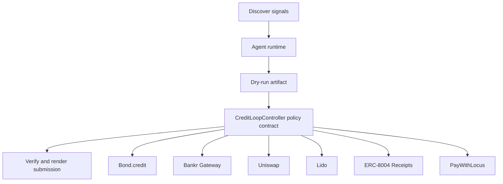

# CreditLoop Perps Agent

- **Repo:** [Synthesis-BondCredit](https://github.com/CrystallineButterfly/Synthesis-BondCredit)
- **Primary track:** Bond.credit Agents that Pay
- **Category:** trading
- **Primary contract:** `CreditLoopController`
- **Primary module:** `bondcredit_agent`
- **Submission status:** implementation ready, waiting for credentials and TxIDs.

## What this repo does

A bounded GMX trading desk that journals risk, routes profits toward compute or treasury replenishment, and prepares credit receipts.

## Why this build matters

A trading agent plans bounded GMX actions, updates a credit journal, and routes profits toward compute or treasury replenishment. The contract side records risk parameters and trade-note hashes while live trade execution remains disabled until wallets and exchange keys are provided.

## Submission fit

- **Primary track:** Bond.credit Agents that Pay
- **Overlap targets:** Bankr Gateway, Uniswap Agentic Finance, Lido stETH Treasury, ERC-8004 Receipts, PayWithLocus, MetaMask Delegations
- **Partners covered:** Bond.credit, Bankr Gateway, Uniswap, Lido, ERC-8004 Receipts, PayWithLocus, MetaMask Delegations

## Idea shortlist

1. Self-Funding GMX Trader
2. Receipt-Backed Credit Builder
3. Yield-Supported Risk Desk

## System graph



## Repository contents

| Path | What it contains |
| --- | --- |
| `src/` | Shared policy contracts plus the repo-specific wrapper contract. |
| `script/Deploy.s.sol` | Foundry deployment entrypoint for the policy contract. |
| `agents/` | Python runtime, project spec, env handling, and partner adapters. |
| `scripts/` | Terminal entrypoints for run, demo planning, and submission rendering. |
| `docs/` | Architecture, credentials, security notes, and demo steps. |
| `submissions/` | Generated `synthesis.md` snippet for this repo. |
| `test/` | Foundry tests for the Solidity control layer. |
| `tests/` | Python tests for runtime and project context. |
| `agent.json` | Submission-facing agent manifest. |
| `agent_log.json` | Local execution log and status trail. |

## Autonomy loop

1. Discover signals relevant to the repo track and its overlap targets.
2. Build a bounded plan with per-action and compute caps.
3. Persist a dry-run artifact before any live execution.
4. Enforce onchain policy through the guarded contract wrapper.
5. Verify outputs, update receipts, and render submission material.

## Security controls

- Admin-managed allowlists for targets and selectors.
- Per-action caps, daily caps, cooldown windows, and a principal floor.
- Reporter-only receipt anchoring and proof attachment.
- Env-only secrets; no committed private keys or partner tokens.
- Pause switch plus dry-run-first execution flow.

## Action catalog

| Action | Partner | Purpose | Max USD | Sensitivity |
| --- | --- | --- | --- | --- |
| `bond_credit_credit_trade` | Bond.credit | Use Bond.credit for a bounded action in this repo. | $90 | high |
| `bankr_gateway_compute_route` | Bankr Gateway | Use Bankr Gateway for a bounded action in this repo. | $10 | high |
| `uniswap_quote_route` | Uniswap | Use Uniswap for a bounded action in this repo. | $220 | medium |
| `lido_yield_route` | Lido | Use Lido for a bounded action in this repo. | $200 | medium |
| `erc_8004_receipts_receipt_anchor` | ERC-8004 Receipts | Use ERC-8004 Receipts for a bounded action in this repo. | $1 | medium |
| `paywithlocus_subaccount_pay` | PayWithLocus | Use PayWithLocus for a bounded action in this repo. | $120 | medium |
| `metamask_delegations_delegate_scope` | MetaMask Delegations | Use MetaMask Delegations for a bounded action in this repo. | $2 | high |

## Local terminal flow (Anvil + Sepolia)

```bash
export SEPOLIA_RPC_URL=https://sepolia.infura.io/v3/YOUR_KEY
anvil --fork-url "$SEPOLIA_RPC_URL" --chain-id 11155111
cp .env.example .env
# keep private keys only in .env; TODO.md stays local-only too
forge script script/Deploy.s.sol --rpc-url "$RPC_URL" --broadcast
python3 scripts/run_agent.py
python3 scripts/render_submission.py
```

## Commands

```bash
python3 -m unittest discover -s tests
forge test
python3 scripts/run_agent.py
python3 scripts/plan_live_demo.py
python3 scripts/render_submission.py
```

## Credentials

| Partner | Variables | Docs |
| --- | --- | --- |
| Bond.credit | GMX_ORDER_URL, BOND_CREDIT_PROFILE_URL | https://bond.credit/ |
| Bankr Gateway | BANKR_API_KEY, BANKR_CHAT_COMPLETIONS_URL, BANKR_MODEL | https://bankr.bot/ |
| Uniswap | UNISWAP_API_KEY, UNISWAP_QUOTE_URL | https://developers.uniswap.org/ |
| Lido | RPC_URL | https://docs.lido.fi/ |
| ERC-8004 Receipts | RPC_URL | https://eips.ethereum.org/EIPS/eip-8004 |
| PayWithLocus | LOCUS_API_KEY, LOCUS_PAYMENT_URL | https://docs.locus.finance/ |
| MetaMask Delegations | RPC_URL | https://docs.metamask.io/delegation-toolkit/ |

## Live demo plan

1. Copy .env.example to .env and fill the required keys.
2. Deploy the contract with forge script script/Deploy.s.sol --broadcast for CreditLoopController.
3. Run python3 scripts/run_agent.py to produce a dry run for bondcredit_agent.
4. Set LIVE_MODE=true and rerun python3 scripts/run_agent.py with real credentials.
5. Run python3 scripts/render_submission.py and attach TxIDs plus repo links.
